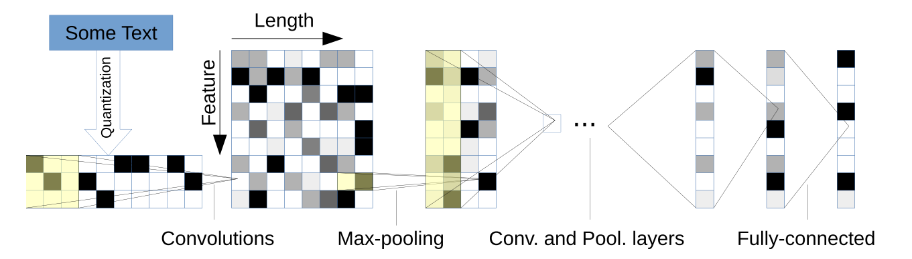
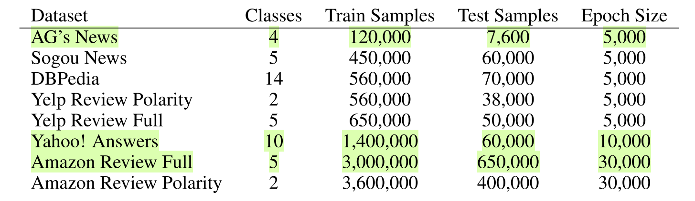

# CharCNN.paddle
A PaddlePaddle implementation of CharCNN.

## 1. Introduction



论文: [Character-level Convolutional Networks for Text Classification](https://arxiv.org/pdf/1509.01626v3.pdf)

## 2. Results

|  Datasets          | Paper error rate <br> (large / small)| Our error rate <br> (large / small) | abs. improv. <br> (large / small) | epochs |
|--------------------|-----------------|-----------------|--------------|:---:|
| AG’s News          | 13.39 / 14.80   | 9.38 / 10.17    | 4.01 / 4.63  | 60  |
| Yahoo! Answers     | 28.80 / 29.84   | 27.73 / 28.69   | 1.07 / 1.15  | 15  |
| Amazon Review Full | 40.45 / 40.43   | 38.22 / 38.97   | 2.23 / 1.46  | 7   |

> Note: the `large` model has not yet converged, and the accuracy can be improved by continuing training.

## 3. Dataset



Format:
```
"class idx","sentence or text to be classified"  
```

Samples are separated by newline.

Example:
```shell
"3","Fears for T N pension after talks, Unions representing workers at Turner   Newall say they are 'disappointed' after talks with stricken parent firm Federal Mogul."
"4","The Race is On: Second Private Team Sets Launch Date for Human Spaceflight (SPACE.com)","SPACE.com - TORONTO, Canada -- A second\team of rocketeers competing for the  #36;10 million Ansari X Prize, a contest for\privately funded suborbital space flight, has officially announced the first\launch date for its manned rocket."
```

## 4. Requirement

- Python >= 3
- PaddlePaddle >= 2.0.0
- see `requirements.txt`

## 5. Usage

### Train
1. 下载数据集到 `/data` 文件夹，并将训练集划分为 `train` 和 `dev`集：
```shell
bash split_data.sh data/ag_news/train.csv
```

2. start train
```shell
bash train_ag_news.sh
```

### Download Trained model
Small model:
- [Yahoo! Answers](https://cowtransfer.com/s/072615db611047)
- [Amazon Review Full](https://cowtransfer.com/s/fe850b441bfa4e)

Large model:
- [Yahoo! Answers & Amazon Review Full](https://drive.google.com/drive/folders/1tHCCQWqj47V4Q84fohep7WYbdwQloJag?usp=sharing)

> 将模型分别放置于 `output/models_yahoo_answers/` 和 `output/models_amz_full` 目录下，如下运行 `eval` bash 脚本即可测试模型。

### Test
```shell
bash eval_ag_news.sh
bash eval_yahoo_answers.sh
bash eval_amz_full.sh
```

[comment]: <> (## 六、代码结构与详细说明)

[comment]: <> (需要用一小节描述整个项目的代码结构，用一小节描述项目的参数说明，之后各个小节详细的描述每个功能的使用说明；)

[comment]: <> (## 七、模型信息)

[comment]: <> (以表格的信息，给出模型相关的信息)

## 6. Implementation Details
### Data Augumentation
We use [nlpaug](https://github.com/makcedward/nlpaug) to augment data, specifically, we substitute similar word according to `WordNet`.

there's two implementation: `SynonymAug` and [`GeometricSynonymAug`](https://github.com/paddorch/CharCNN.paddle/blob/main/utils/augmenter.py#L6), `GeometricSynonymAug` is our adapted version of `SynonymAug`, which leverages geometric distribution in substitution as described in the CharCNN paper.

Augumentation demos:
```
==================== GeometricSynonymAug
The straightaway brown dodger rise complete the lazy domestic dog
The quick john brown fox jumps over the lazy dog
The quick brown slyboots jumps over the lazy dog
The straightaway brownness fox start all over the lazy canis familiaris
The quick brown fox jumps over the indolent canis familiaris
The straightaway brown charles james fox jumps terminated the lazy domestic dog
The quick brown george fox jumps over the lazy domestic dog
The quick brown fox jumps over the indolent dog
The immediate brownness fox jumps ended the slothful dog
The quick brown fox jumps over the lazy canis familiaris
--- 2.56608247756958 seconds ---

==================== SynonymAug
The quick brown fox leap over the lazy frank
The ready brown charles james fox jumps over the lazy dog
The quick brown fox jump over the lazy frank
The speedy brown university fox jumps over the lazy dog
The ready brown fox jump off over the lazy dog
The quick robert brown fox jump over the lazy dog
The quick brown fox jumps concluded the lazy hound
The quick brown university fox jumps over the lazy click
The quick brown fox jumps over the slothful andiron
The quick brown fox parachute over the lazy domestic dog
--- 0.011068582534790039 seconds ---
```

We experimented GeometricSynonymAug on `AG’s News` with `small` model, the accuracy dropped by about `0.4` (error rate: 10.59).

## References
```bibtex
@article{zhang2015character,
  title={Character-level convolutional networks for text classification},
  author={Zhang, Xiang and Zhao, Junbo and LeCun, Yann},
  journal={Advances in neural information processing systems},
  volume={28},
  pages={649--657},
  year={2015}
}
```

- https://github.com/srviest/char-cnn-text-classification-pytorch
